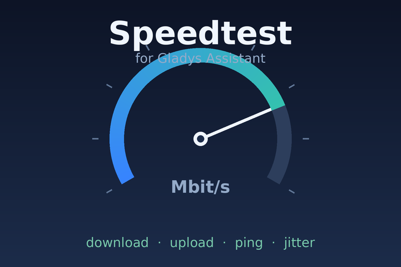

# Gladys Speedtest

[Gladys Assistant](https://gladysassistant.com) external integration that
measures your internet connection on a schedule against
[Speedtest.net](https://www.speedtest.net) servers — the Gladys counterpart of
Home Assistant's popular Speedtest.net integration.

One virtual device, four historized sensors: **download** (Mbit/s), **upload**
(Mbit/s), **ping** (ms) and **jitter** (ms). Chart them on your dashboard,
trigger scenes when the line degrades, spot a 4G failover taking over.



## Install

In Gladys: **Integrations → search "Speedtest.net" → Install**. The user
documentation (configuration, data-usage caveats, troubleshooting) lives in
[docs/en.md](docs/en.md) / [docs/fr.md](docs/fr.md) and is shown by Gladys
during installation.

## How it measures

Pure JavaScript, no Ookla binary (its license forbids redistribution), no API
key. The engine (`src/speedtest.js`) talks to the same HTTP endpoints the
official web client uses on every Speedtest.net (OoklaServer) host:

- `GET /hi` — latency samples (ping = best sample, jitter = mean successive delta);
- `GET /download?size=N` — parallel connections stream and discard bytes;
- `POST /upload` — parallel connections push random bytes, counted at flush time.

Server auto-selection probes the closest catalog entries and keeps the fastest
one that actually answers — the catalog does list dead servers. A 2-second
warmup is discarded on each direction so TCP slow start does not skew the
result. Two hard-won implementation notes, should you hack on the engine:
OoklaServer replies **500 to any request without a `User-Agent`**, and upload
throughput needs **big write chunks + keep-alive connections**, otherwise the
event loop (not the line) is what you measure.

## Development

```bash
npm install
npm test          # node --test
npm run lint      # eslint
npm run format    # prettier
```

The integration follows the official
[integration-template-js](https://github.com/GladysAssistant/integration-template-js)
layout: `index.js` wires the SDK, `src/devices/speedtest.js` declares the
device and its actions, `gladys-assistant-integration.json` is the manifest the
store indexer reads.

## Release

GitHub **Actions → Release → Run workflow** (patch/minor/major). The workflow
bumps `package.json` + manifest in lockstep, tags, and publishes the
multi-arch image (amd64 + arm64) to
[ghcr.io/guim31/gladys-speedtest](https://ghcr.io/guim31/gladys-speedtest).
The decentralized store indexer picks up the new version within the hour.

## Legal

Independent community project, not affiliated with or endorsed by Ookla.
Speedtest® is a trademark of Ookla, LLC. Code under the
[Apache-2.0](LICENSE) license.
